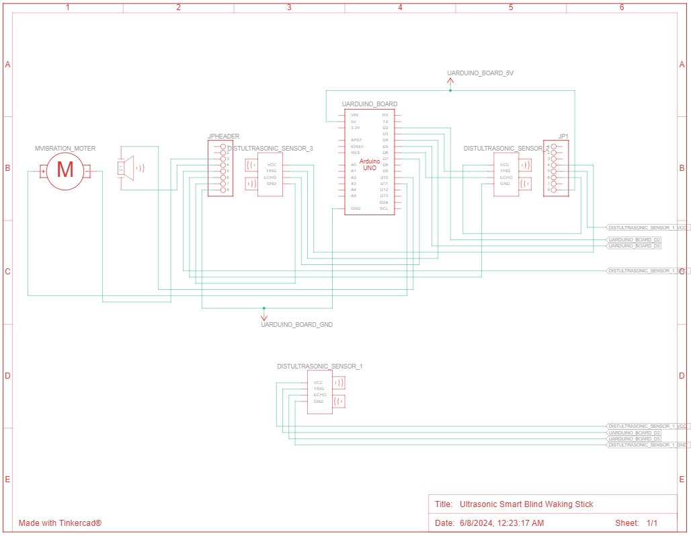

# 👨‍🦯 Ultrasonic Smart Blind Walking Stick

An assistive device designed to enhance mobility for visually impaired individuals by detecting obstacles using ultrasonic sensors and providing feedback through vibrations and sound alerts.

## 📜 Table of Contents

- [Introduction](#introduction)
- [Features](#features)
- [Hardware Requirements](#hardware-requirements)
- [Software Requirements](#software-requirements)
- [Circuit Diagram](#circuit-diagram)
- [Setup and Installation](#setup-and-installation)
- [Usage](#usage)
- [Contributing](#contributing)
- [License](#license)

## 🌟 Introduction

The Ultrasonic Smart Blind Walking Stick is an innovative tool aimed at providing assistance to visually impaired individuals. By utilizing ultrasonic sensors, the device detects obstacles in the user's path and alerts them through vibrations and sound, ensuring safer and more independent navigation.

## ✨ Features

- **Obstacle Detection**: Three ultrasonic sensors positioned at 60-degree angles to cover a wide detection area.
- **Alerts**: Provides feedback via a vibration motor and a buzzer when an obstacle is detected within a predefined range.
- **Microcontroller**: Controlled by an Arduino, allowing for easy customization and expansion.

## 🛠️ Hardware Requirements

- **Arduino Board** (e.g., Arduino Uno)
- **Ultrasonic Sensors** (3 units)
- **Vibration Motor**
- **Buzzer**
- **Connecting Wires**
- **Power Supply**
- **Mounting Frame** (to attach components to a cane or stick)

## 💻 Software Requirements

- **Arduino IDE**: For writing and uploading the code to the Arduino board.

## 🔌 Circuit Diagram

*Note: The schematic diagram illustrates the connections between the Arduino, ultrasonic sensors, vibration motor, and buzzer.*

## 🚀 Setup and Installation

1. **Hardware Assembly**:
   - Mount the three ultrasonic sensors at the front of the stick, each angled 60 degrees apart to cover a wide detection area.
   - Connect the sensors to the Arduino as per the schematic diagram.
   - Attach the vibration motor and buzzer to the handle of the stick, ensuring they are in positions where the user can easily perceive the alerts.
   - Ensure all components are securely attached and wired correctly.

2. **Software Setup**:
   - Download and install the [Arduino IDE](https://www.arduino.cc/en/software).
   - Clone or download this repository to your local machine.
   - Open the `Ultra_Sonic_Waking_Stic.ino` file in the Arduino IDE.
   - Connect your Arduino board to the computer via USB.
   - Select the appropriate board and port from the Arduino IDE settings.
   - Upload the code to the Arduino.

## 🎯 Usage

- **Power On**: Turn on the device using the power switch.
- **Operation**: As you move, the ultrasonic sensors will detect obstacles within the predefined range.
  - When an obstacle is detected, the buzzer will emit a sound, and the vibration motor will activate, alerting you to the presence of an obstacle.
- **Power Off**: After use, turn off the device to conserve battery life.

## 🤝 Contributing

Contributions are welcome! Please follow these steps:

1. Fork this repository.
2. Create a new branch (`git checkout -b feature-branch`).
3. Make your changes and commit them (`git commit -m 'Add new feature'`).
4. Push to the branch (`git push origin feature-branch`).
5. Create a Pull Request detailing your changes.

## 📄 License

This project is licensed under the MIT License. See the [LICENSE](LICENSE) file for more details.
 
